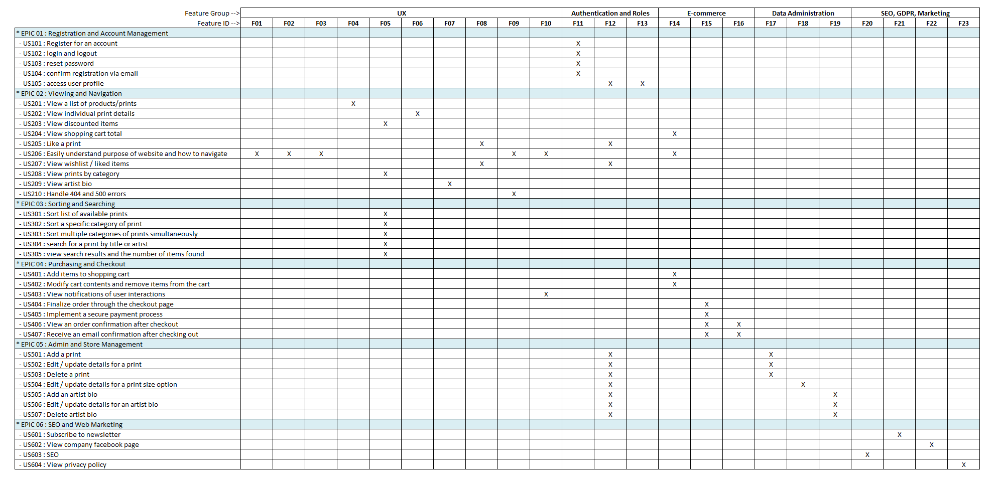

<h1 align="center">Íomhá Prints - Order Prints Online</h1>

[View the live project here](???????)

The Íomhá Prints project ???????? - to be written

## Index – Table of Contents
* [User Experience (UX)](#user-experience-ux) 
* [Features](#features)
* [Design](#design)
* [Planning](#planning)
* [Technologies Used](#technologies-used)
* [Testing](#testing)
* [Deployment](#deployment)
* [Credits](#credits)

## User Experience (UX)

### User stories :

* US01: To be written
  - As a **????** I can **????** so that **????**

## Features

### Existing Features

- include SEO stuff and privacy policy info here.

-   __F01 to be written__
    
    To be written  
    
    
    

-   __How these features support the user stories__
    
    The User Stories in the [User Experience (UX)](#user-experience-ux) part of this document are numbered 1 to ?????.  The existing features are listed above as F01 to ?????.  Below is a traceability matrix cross-referencing the user stories with the features, illustrating which features support which stories :
        
    

### Features which could be implemented in the future

-   __to be written__
    
    to be written

## Design

-   ### Wireframes

    The wireframe diagrams below describe the ??????? pages.  

    

    
Desktop Wireframes

    
    

    

    
Tablet Wireframes

    
    

    

    
Smartphone Wireframes

    
    

-   ### Entity-Relationship diagrams for DBMS
    
      Notes on the ER diagrams :  - to be written ?????  leave this here as it may be useful

      - The ER diagrams provided show the logical data model.  The many-to-many relationship between hikes and their 'likes' is represented as normalized tables to clarify the relationship.  In the models.py file the 'likes' data item is declared as part of the Hike class, with django handling how this relationship is represented in the physical database tables in the background.

      - The Users table in the ER diagrams is also a logical representation of the data captured during user registration and how it relates to the application data model.  The Users table itself is not declared in the models.py file, but is handled by the django modules and this logical view does not reflect all columns and constraints etc. used by the physical data tables in the database.

      - The data model tables are split into two diagrams so that the relationships between the tables can be easily read.

      - A booking is a many-to-many relationship between Schedule and Users but because it also has its own data - places_reserved, it is declared in its own separate class in models.py

      - Because there could be multiple guided hikes on the same hike trail in a single day, the schedule table needs a composite primary key of the hike_id and 'starts' column.  This is handled using a constraint in models.py.

    

    
ER Diagrams - ??????

    
    

## Planning

A GitHub Project with linked Issues was used as the Agile tool for this project.  User Stories with acceptance criteria were defined using GitHub Issues and development of code for these stories was managed using a Kanban board.  All of the User Stories were linked 'parent' Epic issues to show how they all supported the over-arching goal of the project.  The acceptance criteria were tested as each story moved to 'Done' and were also included in the final pre-submission manual testing documented in the Testing section of this README.

The Epic, User Stories and Kanban board can be accessed here : [Iomha Print Agile Tool](????)

## Technologies Used

### Languages Used - to be written

-   [HTML5](https://en.wikipedia.org/wiki/HTML5)
-   [CSS3](https://en.wikipedia.org/wiki/Cascading_Style_Sheets)
-   [Jquery](https://jquery.com/) ??????????????????????
-   [Python](https://www.python.org/)

### Frameworks, Libraries & Programs Used  - to be written

-   [Google Fonts:](https://fonts.google.com/) used for the Lato font
-   [Font Awesome:](https://fontawesome.com/) was used to add icons for aesthetic and UX purposes.
-   [Git:](https://git-scm.com/) was used for version control by utilising the Gitpod terminal to commit to Git and Push to GitHub.
-   [GitHub:](https://github.com/) is used as the respository for the project code after being pushed from Git. In addition, for this project GitHub was used for the agile development aspect through the use of User Stories (GitHub Issues) and tracking them on a Kanban board.
-   [Django](https://www.djangoproject.com/) was used as the framework to support rapid and secure development of the application

to be written - list left here for reference
-   [dbdiagram.io](https://dbdiagram.io/home) was used to create the Entity Relationship diagrams for the application data model
-   [Balsamiq:](https://balsamiq.com/) was used to create the wireframes during the design process.
-   [Django](https://www.djangoproject.com/) was used as the framework to support rapid and secure development of the application
-   [Bootstrap](https://getbootstrap.com/) was used to build responsive web pages
-   [Gunicorn](https://gunicorn.org/) was used as the Web Server to run Django on Heroku
-   [dj_database_url](https://pypi.org/project/dj-database-url/) library used to allow database urls to connect to the postgres db
-   [psycopg2](https://pypi.org/project/psycopg2/) database adapter used to support the connection to the postgres db
-   [Cloudinary](https://cloudinary.com/) used to store the images used by the application
-   [Summernote](https://pypi.org/project/django-summernote/) used to provide WYSIWYG editing on the Hike editing screen
-   [Django allauth](https://django-allauth.readthedocs.io/en/latest/index.html) used for account registration and authentication
-   [Django crispy forms](https://django-crispy-forms.readthedocs.io/en/latest/) used to simplify form rendering
-   [jquery library](https://ajax.googleapis.com/ajax/libs/jquery/1.12.4/jquery.min.js) used to fade out alert messages
-   [Django testing tools](https://docs.djangoproject.com/en/3.2/topics/testing/tools/) used for python mvt testing
-   [Jest](https://jestjs.io/) - used to test jquery in script.js
-   [coverage](https://coverage.readthedocs.io/en/coverage-5.5/) used to check how much of the python code has been covered by 
automated tests

## Testing

### Validator Testing 

- [HTML Validator](https://validator.w3.org/)

    - As this project uses Django templates the html has been validated by manually clicking through the application pages, copying the source of the rendered pages and then validating this version of the html using the W3C Validator (link shown above). 

    - results for index.html
      - 

        
Index Page - Summary

        
      

      - <a href="?????" target="_blank">Index Page - Full HTML Validation Results</a>

- [CSS Validator](https://jigsaw.w3.org/css-validator/)

    - 

      
?????? validation results

      
      

    - <a href="???" target="_blank">CSS Validation - Full Results</a> 

- [Javascript Validator](https://jshint.com/)

  

    
??????.js validation results

    
  

- [Python Validator](http://pep8online.com/)

  

    
?????? validation results

    
  

### Automated Testing - to be written - may not need this

### Browser Compatibility

- Chrome DevTools was used to test the responsiveness of the application on different screen sizes.  In addition, testing has been carried out on the following browsers :
    - to be written
 
### Manual Testing Test Cases and Results - to be written

- The link below details the test cases that were used, the results, and a cross-reference to the Feature ID that each test case exercised (click link to open pdf).  The test cases are primarily based on the User Story acceptance criteria that were used to test iterations of the code during development.
  
  - <a href="?????" target="_blank">Manual Testing - Test Cases and Results</a>

### Known bugs

- To be written

## Deployment  - leaving this here for now but all needs to be rewritten

Detailed below are instructions on how to clone this project repository and the steps to configure and deploy the application.  Code Institute also provides a summary of similar process steps here : [CI Cheat Sheet](https://codeinstitute.s3.amazonaws.com/fst/Django%20Blog%20Cheat%20Sheet%20v1.pdf)

1. How to Clone the Repository
2. Create Application and Postgres DB on Heroku
3. Configure Cloudinary to host images used by the application
4. Connect the Heroku app to the GitHub repository
5. Executing automated tests
6. Final Deployment steps

### How to Clone the Repository 

- Go to the https://github.com/elainebroche-dev/pf4-wayfarers-guided-hikes repository on GitHub 
- Click the "Code" button to the right of the screen, click HTTPs and copy the link there
- Open a GitBash terminal and navigate to the directory where you want to locate the clone
- On the command line, type "git clone" then paste in the copied url and press the Enter key to begin the clone process
- To install the packages required by the application use the command : pip install -r requirements.txt
- When developing and running the application locally set DEBUG=True in the settings.py file
- Changes made to the local clone can be pushed back to the repository using the following commands :

  - git add *filenames*  (or "." to add all changed files)
  - git commit -m *"text message describing changes"*
  - git push

- N.B. Any changes pushed to the master branch will take effect on the live project once the application is re-deployed from Heroku

### Create Application and Postgres DB on Heroku
- Log in to Heroku at https://heroku.com - create an account if needed.
- From the Heroku dashboard, click the Create new app button.  For a new account an icon will be visible on screen to allow you to Create an app, otherwise a link to this function is located under the New dropdown menu at the top right of the screen.
- On the Create New App page, enter a unique name for the application and select region.  Then click Create app.
- On the Application Configuration page for the new app, click on the Resources tab.
- In the Add-ons search bar enter "Postgres" and select "Heroku Postgres" from the list - click the "Submit Order Form" button on the pop-up dialog.
- Next, click on Settings on the Application Configuration page and click on the "Reveal Config Vars" button - check the DATABASE_URL has been automatically set up. 
- Add a new Config Var called DISABLE_COLLECTSTATIC and assign it a value of 1.
- Add a new Config Var called SECRET_KEY and assign it a value - any random string of letters, digits and symbols.
- The settings.py file should be updated to use the DATABASE_URL and SECRET_KEY environment variable values as follows :

  - DATABASES = {'default': dj_database_url.parse(os.environ.get('DATABASE_URL'))}

  - SECRET_KEY = os.environ.get('SECRET_KEY')

- In Gitpod, in the project terminal window, to initialize the data model in the postgres database, run the command : python3 manage.py migrate 
- Make sure the project requirements.txt file is up to date with all necessary supporting files by entering the command : pip3 freeze --local > requirements.txt
- Commit and push any local changes to GitHub.
- In order to be able to run the application on localhost, add SECRECT_KEY and DATABASE_URL and their values to env.py

### Configure Cloudinary to host images used by the application
- Log in to Cloudinary - create an account if needed.  To create the account provide your name, email and set up a password.  For "primary interest" you can choose "Programmable Media for image and video API".  Click "Create Account" and you will be sent an email to verify your account and bring you to the dashboard.
- From the dashboard, copy the "API Environment variable" value by clicking on the "Copy to clipboard" link.
- Log in to Heroku and go to the Application Configuration page for the application.  Click on Settings and click on the "Reveal Config Vars" button.
- Add a new Config Var called CLOUDINARY_URL and assign it the value copied from the Cloudinary dashboard, but remove the "CLOUDINARY_URL=" at the beginning of the string. 
- In order to be able to run the application on localhost, also add the CLOUDINARY_URL environment variable and value to env.py

### Connect the Heroku app to the GitHub repository
- Go to the Application Configuration page for the application on Heroku and click on the Deploy tab.
- Select GitHub as the Deployment Method and if prompted, confirm that you want to connect to GitHub. Enter the name of the github repository (the one used for this project is (https://github.com/elainebroche-dev/pf4-wayfarers-guided-hikes) and click on Connect to link up the Heroku app to the GitHub repository code.
- Scroll down the page and choose to either Automatically Deploy each time changes are pushed to GitHub, or Manually deploy - for this project Manual Deploy was selected.
- The application can be run from the Application Configuration page by clicking on the Open App button.
- The live link for this project is (https://pf4-wayfarers.herokuapp.com/)

### Executing automated tests
- The existing automated jquery/javascript test can be executed using jest as follows :
  - If jest is not installed then run the command : npm install --save-dev jest
  - Run the js test file using the command : npm test

- The existing automated django/python tests are executed using unittest as follows :
  - Run the python tests using the command : python3 manage.py test
  - To run just a subset of the tests, then append the application and test file name to the command, e.g. : python3 manage.py test hikebooker.test_models

- Test coverage for the django/python tests can be reviewed using the coverage tool :
  - If coverage is not installed then run the command : pip3 install coverage
  - Execute the following series of commands to determine test coverage :
    - coverage run --source=hikebooker manage.py test
    - coverage report
    - coverage html
    - python3 -m http.server  (detailed results can be viewed via the browser in the htmlcov directory)

### Final Deployment steps
Once code changes have been completed and tested on localhost, the application can be prepared for Heroku deployment as follows :
- Set DEBUG flag to False in settings.py
- Ensure this line exists in settings.py to make summernote work on the deployed environment (CORS security feature): X_FRAME_OPTIONS = 'SAMEORIGIN'
- Ensure requirements.txt is up to date using the command : pip3 freeze --local > requirements.txt
- Push files to GitHub
- In the Heroku Config Vars for the application delete this environment variable :  DISABLE_COLLECTSTATIC
- On the Heroku dashboard go to the Deploy tab for the application and click on deploy branch

#### The live link to the application can be found here - [P5 Iomha Prints](??????) 

## Credits 

### Code 
- Much of the coding and testing relies heavily on information in the "Boutique Ado" walkthrough in the Code Institue Building an E-Commerce Platform module. 
- Code on how to ??? : [?????](??????)

### Content 
- To be written : [????](?????)

### Media 
- The ??? font used was imported from [Google Fonts](https://fonts.google.com/)
- Fontawesome was used for icons, including icons for ????? - [Font Awesome](https://fontawesome.com/)
- The application favicon was created from the ???????" icon image on [Font Awesome](https://fontawesome.com/) 
- To be written ???????????????????
  
### Acknowledgments

- Thank you to my mentor Brian Macharia for all of his guidance, help and feedback throughout each project on this course. 