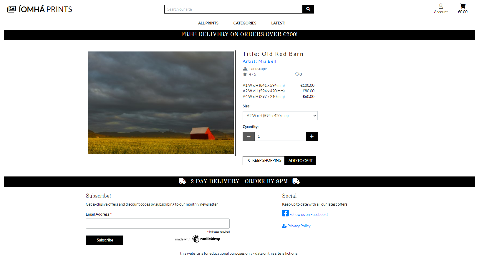
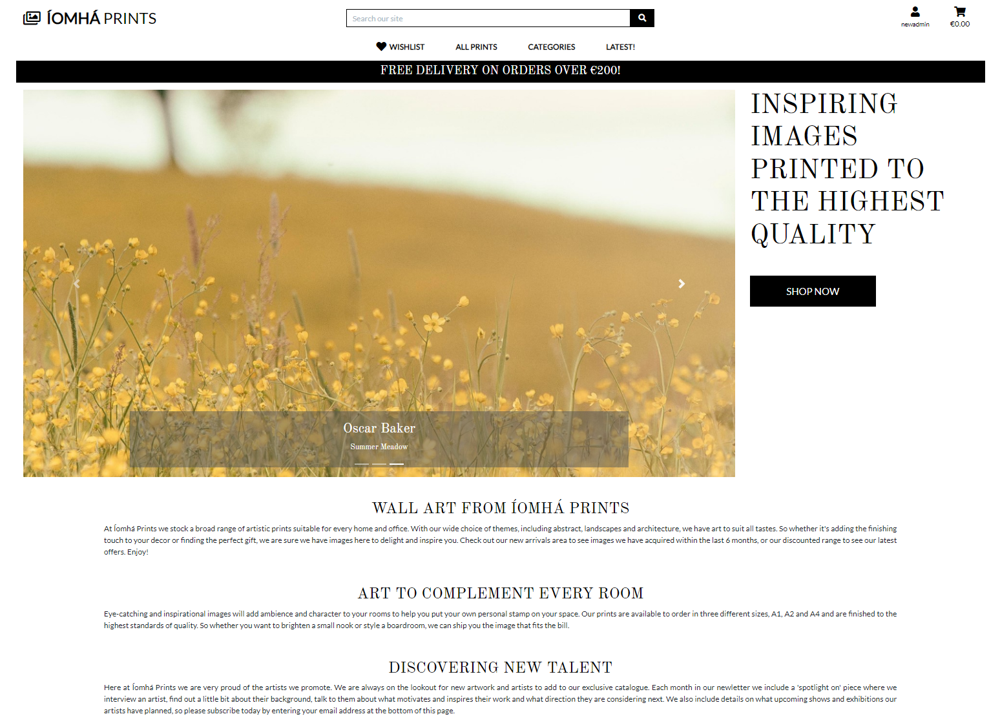
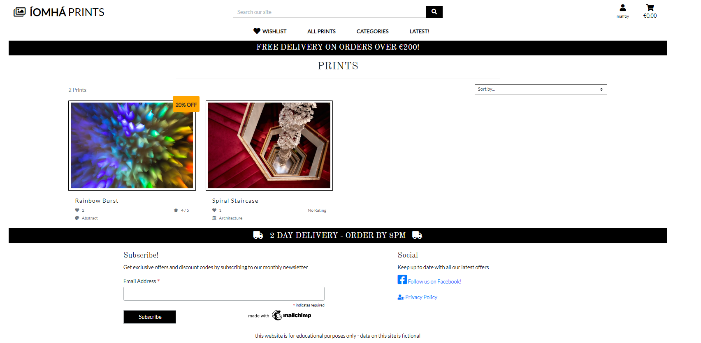
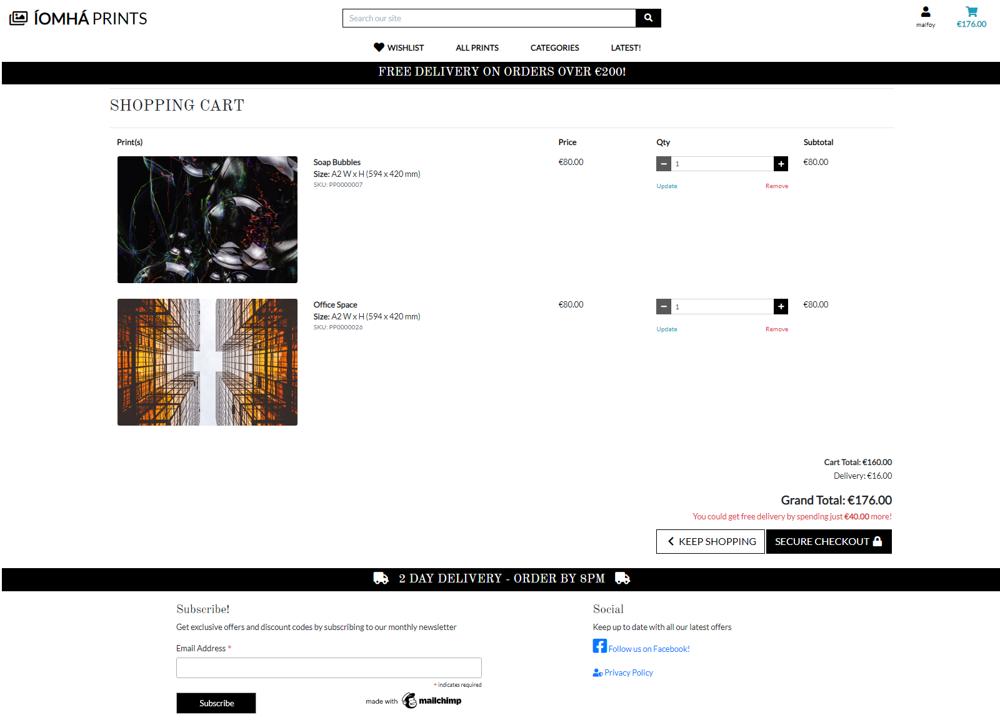
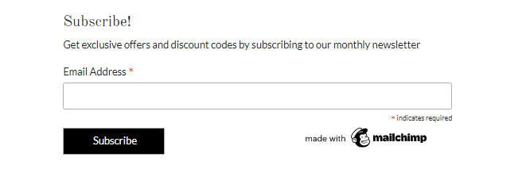

<h1 align="center">Íomhá Prints - Order Prints Online</h1>

[View the live project here](https://pf5-iomha-prints.herokuapp.com/)

The Íomhá Prints project is a B2C e-commerce application which sells art prints directly to end customers.  The site aims to present users with an attractive and intuitive online shopping experience and encourage return visits through features such as discounts, a newsletter, social media posts, and an easy to use user profile function to save customer details.

The site is implemented as a retail store where users can view, search and filter the products on offer, then select items to add to their shopping cart and purchase through a secure single payment.

General users can view details of the prints available for purchase including bio information on the print artist, and can sign up to the company newletter. In addition, registered users can create a wishlist of prints they may be interested in and a profile to keep track of delivery details and order history.

Admin users can manage the lists of prints and artists, this includes being able to add new prints to the range, update pricing, link artists to prints, update artist bio information.  A full description of the available functionality is included in this document.

The Web Marketing strategies used by the project are :
- Organic Social - through facebook
- Email - through a newletter subscription managed via Mailchimp

The structure and purpose of the Íomhá Prints project is based on the Code Institute Boutique Ado walkthrough example application.

## Index – Table of Contents
* [User Experience (UX)](#user-experience-ux) 
* [Features](#features)
* [Design](#design)
* [Planning](#planning)
* [Technologies Used](#technologies-used)
* [Testing](#testing)
* [Deployment](#deployment)
* [Credits](#credits)

## User Experience (UX)

### User stories :

* EPIC 01 : Registration and Account Management
  

      
User Stories for EPIC 01: 

  - US101 : Register for an account
      - As a **site user** I can **register for an account** so that **I can view my profile and purchasing history**
  - US102 : login and logout
      - As a **site user** I can **easily login or logout** so that **I can access my personal account information**
  - US103 : reset password
      - As a **site user** I can **easily reset my password in case I forget** so that **I can recover access to my account**
  - US104 : confirm registration via email
      - As a **site user** I can **receive an email confirmation after registering** so that **I can verify that my account registration was successful**
  - US105 : access user profile
      - As a **site user** I can **access my personalized user profile** so that **I can view my personal order history and order confirmations and my payment information**

  

* EPIC 02 : Viewing and Navigation
  

      
User Stories for EPIC01: 

  - US201 : View a list of products/prints
      - As a **site user** I can **view a list of prints** so that **I can select some to purchase**
  - US202 : View individual print details
      - As a **site user** I can **view details for a specific print** so that **I can see the description, rating, print image, available sizes and pricing**
  - US203 : View discounted items
      - As a **site user** I can **easily identify discounted items** so that **I can take advantage of savings on prints I want to purchase**
  - US204 : View shopping cart total
      - As a **site user** I can **easily view the total of my purchases at any time** so that **I can avoid over-spending**
  - US205 : Like a print
      - As a **site user** I can **'like' a print** so that **it is added to my  wishlist in my personal profile**
  - US206 : Easily understand purpose of website and how to navigate
      - As a **site user** I can **quickly identify what the website is selling and easily navigate the pages** so that **I can quickly find the information and functionality I am looking for**
  - US207 : View wishlist / liked items
      - As a **site user** I can **view my wishlist** so that **I can see prints I have 'liked'**
  - US208 : View prints by category
      - As a **site user** I can **view a specific category of prints** so that **I can quickly narrow down the range of prints I am interested in**
  - US209 : View artist bio
      - As a **site user** I can **view bio details of the artist of a specific print** so that **I can easily find out more about the artist**
  - US210 : Handle 404 and 500 errors 
      - As a **site user** I can **return to Home after http 404 or 500 response** so that **I feel I am still working within the website and can navigate easily**

  

* EPIC 03 : Sorting and Searching
  

      
User Stories for EPIC01: 

  - US301 : Sort list of available prints
      - As a **site user** I can **sort the list of available prints** so that **I can easily identify the best rated and categorically sorted products**
  - US302 : Sort a specific category of print
      - As a **site user** I can **sort a specific category of print** so that **I can find the best-rated print in a specific category or sort the prints in the category or sort the prints in that category by title**
  - US303 : Sort multiple categories of prints simultaneously
      - As a **site user** I can **sort multiple categories of prints simultaneously** so that **I can find the best-rated print in a specific category, or sort the prints across broad categories, such as "nature" or "architecture"**
  - US304 : search for a print by title or artist
      - As a **site user** I can **search for a print by title or artist** so that **I can find a specific print to purchase**
  - US305 : view search results and the number of items found
      - As a **site user** I can **easily view what I've searched for and the number of results** so that **I can quickly decide whether the print I want is available**

  

* EPIC 04 : Purchasing and Checkout
  

      
User Stories for EPIC01: 

  - US401 : Add items to shopping cart
      - As a **site user** I can **add items to my shopping cart** so that **I can choose multiple items to purchase**
  - US402 : Modify cart contents and remove items from the cart
      - As a **site user** I can **modify cart quantities and remove items from the shopping cart** so that **manage the contents of my shopping cart and rectify any mistakes in selecting purchases**
  - US403 : View notifications of user interactions
      - As a **site user** I can **get notifications on screen of my actions** so that **I can easily understand my interactions with the website and their consequences**
  - US404 : Finalize order through the checkout page
      - As a **site user** I can **complete my order by going through the checkout page** so that **I can see a final total, a summary of my order and I can specify a delivery address and payment details**
  - US405 : Implement a secure payment process
      - As a **site user** I can **enter my payment details** so that **my payment is secure**
  - US406 : View an order confirmation after checkout
      - As a **site user** I can **view an order confirmation after checkout** so that **I can see what was ordered and total costs**
  - US407 : Receive an email confirmation after checking out
      - As a **site user** I can **receive an email confirmation after checking out** so that **I have a record of my purchases**

  

* EPIC 05 : Admin and Store Management
  

      
User Stories for EPIC01: 

  - US501 : Add a print
      - As a **site admin** I can **add a print** so that **I can sell new items in my store**
  - US502 : Edit / update details for a print
      - As a **site admin** I can **edit / update details for a print** so that **I can change or amend the title, image, discount setting and other attributes**
  - US503 : Delete a print
      - As a **site admin** I can **delete a print** so that **I can remove the print for sale**
  - US504 : Edit / update details for a print size option
      - As a **site admin** I can **edit / update details for a print size option** so that **I can change or amend the price or dimensions**
  - US505 : Add an artist bio
      - As a **site admin** I can **add an artist bio** so that **I can give the site users background information on the artist**
  - US506 : Edit / update details for an artist bio
      - As a **site admin** I can **edit / update details for an artist bio** so that **I can change or amend biographical details for the artist**
  - US507 : Delete artist bio
      - As a **site admin** I can **delete an artist** so that **I can remove the artist from the database**

  

* EPIC 06 : SEO and Web Marketing
  

      
User Stories for EPIC01: 

  - US601 : Subscribe to newsletter
      - As a **site user** I can **subscribe to the company newsletter** so that **I can keep up with company news and offers**
  - US602 : View company facebook page
      - As a **site user** I can **find the company on facebook** so that **I can keep up to date with company posts**
  - US603 : SEO
      - As a **site user** I can **find the site through web searches** so that **I can easily access the site**
  - US604 : View privacy policy
      - As a **site user** I can **view the company privacy policy** so that **I can see the company is GDPR compliant**

  

## Features

### Existing Features

Below are descriptions of the main features of the application.  Many of the features are based on the Boutique Ado walkthrough project and SEO and Web Marketing modules of the course.  

The Íomhá Prints application uses a B2C e-commerce model, selling directly to end customers with single online payments to cover purchases.

- **UX Related Features**

    -   __F01 - Consistent page look and feel__
        
        The page layout, navigation bar, header, footer, colours and fonts have a consistent look and feel on all pages of the website to give the user an intuitive easy to use experience.  The navigation bar is responsive on multiple screen sizes - on smaller screens it coverts to a 'burger' menu style. 
        
         <strong>Fig 01-A.  Desktop example</strong>  
        
        
         <strong>Fig 01-B.  Tablet example</strong>  
        

    -   __F02 - User logged in indicator__
        
        The user can easily see if they are logged in from the user icon at the top right of the screen.  If not logged in the user icon appears as an outline and has the text "Account" underneath, if logged in, the user icon is filled in and the user's username (max 12 chars) appears under the icon.  
        
         <strong>Fig 02-A.  User icon when user is not logged in</strong>  
        

         <strong>Fig 02-B.  User icon when user is logged in</strong>  
        

    -   __F03 - Home Page__
        
        The application home page includes an eye-catching carousel which displays a sample of the prints available for purchase on the site.  It also gives introductory content to clearly brief the user on the purpose of site and goal of of the company.  
        
         <strong>Fig 03-A.  Home page</strong>  
        

    -   __F04 - View Prints__
        
        The user can easily scroll through the list of prints available for purchase on the site by using the All Prints option in the navigation bar at the top of the screen. The list presented will show an image of the print and some details including title, category, number of likes and rating. A back-to-top button allows the user to quickly navigate back to the top of the screen.
        
         <strong>Fig 04-A.  List of prints</strong>  
        

    -   __F05 - Filter, Search and Sort options__
        
        There are options available to the user on the navigation bar to filter the list of prints and allow them to restrict the results to items they are particularly interested in.  For example, the user can choose to just see prints for a particular category, or just new arrivals (added within the last 6 months) or just discounted prints.  The user can also restrict the list of results based on a search term which will attempt to find matches in the print titles and artist names.

        The number of matching results is shown on screen and results can be ordered by rating, category, or title.
        
         <strong>Fig 05-A.  List of prints for Nature category</strong>  
        

        In addition, results can be sorted by rating or by category using the navigation bar drop-down options under All Prints.  Alternatively, the sort box on the screen can sort by rating, category and print title.

         <strong>Fig 05-B.  List of Nature prints sorted by rating</strong>  
        

    -   __F06 - View Print Details__
        
        By clicking on a print the user can access the Print Details page which will display the image, category, rating, number of likes, artist name, print options (size and price) and from here they can select the size and quantity of print they want and add them to their cart.  
        
         <strong>Fig 06-A.  Print details</strong>  
        

    -   __F07 - View Artist Details__
        
        From the Print Detail page (F06 above) the user can click on the artist name and view a short bio of the artist associated with the print and learn a bit about their background and work.  
        
         <strong>Fig 07-A.  Artist details</strong>  
        

    -   __F08 - Likes and Wishlist__
        
        If the user is logged in when they visit a Print Detail page (F06 above) they will have the opportunity to 'like' the print.  Clicking on the 'heart' icon will toggle the like/unlike setting for that user for that print.  Liking a print will add that print to the user's wishlist.  The wishlist option is available from the navigation bar - but is only visible when the user is logged in.  Adding items to their withlist enables the user to save items for purchase later.   
        
         <strong>Fig 08-A.  Print can be 'liked' from the print details page</strong>  
        

         <strong>Fig 08-B.  Clicking on Wishlist shows prints the user has 'liked'</strong>  
        

    -   __F09 - Custom HTTP 404 and 500 response pages__
        
        To help support a consistent user-experience and handle unexpected events in a user-friendly manner, custom pages are displayed for any unexpected 404 or 500 HTTP response codes.  
        
         <strong>Fig 09-A.  Custom 404 response page with link to Home</strong>  
        

    -   __F10 - On-screen messages__
        
        Pop-up on-screen messages are used to let the user know the effects of their interactions with the application.  Events such as changing the contents of the shopping cart, submitting an order, logging in or out will result in a message appearing on screen to inform the user of what has happened, and if appropriate, give them an update on the contents of the shopping cart.
        
         <strong>Fig 10-A.  Message to user to confirm login</strong>  
        

         <strong>Fig 10-B.  Message to confirm shoppign cart has been updated</strong>  
        
    
    
- **Authentication and Role-based Authorisation Related Features**

    -   __F11 - Registration, Login, Logout__
        
        Users can register (sign-up) with the site, login (sign-in) and logout (sign-out).  Some features such as the wishlist are only available to logged in users (see F12 below for information on role based interactions).  When registering, users are asked to confirm their email addresses in order to activate the account.
        
         <strong>Fig 11-A.  User Registration / Sign Up</strong>  
        
        
         <strong>Fig 11-B.  User Login / Sign In</strong>  
        

         <strong>Fig 11-C.  Logout / Sign Out</strong>             
        

    -   __F12 - Role based interactions__
        
        Certain functionality within the application is role based.  For example, in order to 'like' a print and add it to their wishlist or save profile information, a user needs to be logged in.

        In addition, data managment tasks such as adding prints or artist information to the website, or changing pricing, are actions which can only be performed by a logged in admin (superuser).  
        
         <strong>Fig 12-A.  Options under User Icon for general users</strong>  
        

         <strong>Fig 12-B.  Options under User Icon for site admin users</strong>  
        

    -   __F13 - User Profile__
        
        If logged/signed in a user can opt to save their delivery address and/or birthday in their profile.  The My Profile page can be accessed via clicking the user icon.   If delivery details have been stored for a user then their details are automatically pre-populated on the checkout page making it quicker and easier for them to checkout.  The profile information can easily be changed simply overwritting the pre-populated values and opting to save this new information on submission of the order, or they can be updated directly via the My Profile page. 

        By giving the user the option of storing their date of birth, this allows the company to track additional information about the user than could be used in marketing - for example offering a special discount on their birthday to encourage them to purchase.
        
         <strong>Fig 13-A.  My Profile page</strong>  
        

- **E-Commerce Related Features**

    -   __F14 - Shopping Cart__
        
        The application uses a 'shopping cart' to track items the user wants to purchase.  This is a common and intuitive metaphor that online shoppers are familiar with and so helps make the application user-friendly.  The shopping cart running total is shown under the shopping cart icon in the top right of the screen and is available on all site pages.

        As items are added to the cart, the total is updated to reflect the cost, taking into consideration any discounts, and the user is shown a summary of what is in the cart in a small pop-up window.

        By clicking on the shopping cart icon the user can view the shopping cart page.  From here they can adjust quanities of the items in the cart or remove them completely.  From this page the user can choose to return to continue shopping or proceed to checkout.
        
         <strong>Fig 14-A.  Shopping Cart icon with current cost</strong>  
        

         <strong>Fig 14-B.  Shopping Cart page</strong>  
        
    
    -   __F15 - Checkout and Secure Payments__
        
        When the user is ready to complete their order they can navigate to the Checkout page.  Here they can enter their details, delivery address and credit card details.  If they have a user profile set up (F13 above) then the delivery details are pre-polulated with their previously stored address.  Also on the checkout page, if logged in, the user can choose to save new delivery details to their profile.

        Payments are securely handled by Stripe widgets in the application, and webhooks are used to ensure that transactions are handled correctly in the case of any problems encountered during payment processing.
        
         <strong>Fig 15-A.  Checkout page</strong>  
        

         <strong>Fig 15-B.  Stripe events example</strong>  
        

         <strong>Fig 15-B.  Stripe webhooks example</strong>  
        

    -   __F16 - Order Confirmation and Order History__
        
        Once an order has been submitted and payment processed, the user is shown an Order Confirmation page and is also sent an email with a summary of the order.

        By accessing the My Profile page, users can view their order history.  
        
         <strong>Fig 16-A.  Order Confirmation page</strong>  
        

         <strong>Fig 16-B.  Order Confirmation email</strong>  
        

         <strong>Fig 16-C.  Order History shown on My Profile page</strong>  
        
 

- **Data Administration Related Features**

    -   __F17 - Print Management__
        
        This feature is only available to site administrators.  Admin users can add, edit and delete prints on the website to manage the items available for purchase.  The add print functionality is accessed by clicking on the user icon and selecting Print Management.  The edit and delete functionality can be accessed from the print list and print detail list pages (F04 and F06).

        Once a print is added it becomes visible to customers and can be added to their carts.  If a print is deleted it is removed from the site.  If the admin user attempts to delete a print they are first prompted to confirm the action, to avoid accidentally deleting a print.
        
         <strong>Fig 17-A.  Add a Print</strong>  
        

         <strong>Fig 17-B.  Links to Edit and Delete Print</strong>  
        
    
    -   __F18 - Print Option Management__
        
        This feature is only available to site administrators. Admin users can edit the print options to update the dimension values or update pricing.  
        
          <strong>Fig 18-A.  Edit Print Option</strong>  
        

    -   __F19 - Artist Management__
        
        This feature is only available to site administrators.  Admin users can add, edit and delete artists in the store database.  The add artist functionality is accessed by clicking on the user icon and selecting Artist Management.  The edit and delete functionality can be accessed from the artist detail list page (F07).

        Once an artist is added it becomes available to link to existing prints.  If an artist is deleted it is removed from the database and any linked prints will show as artist unknown.  If the admin user attempts to delete an artist they are first prompted to confirm the action, to avoid accidental deletions.
        
         <strong>Fig 19-A.  Add an Artist</strong>  
        

         <strong>Fig 19-B.  Links to Edit and Delete an Artist</strong>  
        
    

- **SEO, GDPR and Marketing Related Features**

    -   __F20 - SEO__
        
        A number of steps were implemented in this project to address SEO (Site Engine Optimization) - these included the use of relevant keywords and phrases in the following areas :
        - Informative alt tags
        - "description" and "keyword" meta tags in the html
        - Appropriate site title and home page content
        - Informative site heading slogan on home page

        The process to determine the most useful keywords and phrases was as follows :
        - Initial brainstorm of keywords and terms associated with the items on sale and the target customer audience
        - Use of google search auto-complete to come up with different ideas and long-tail keywords
        - Use of wordtracker.com to come up with some other alternatives and narrow down the list to the keywords most relevant to the target market

        Keywords and phrases identifed as most useful include :
        Art, image, poster, print, inspirational image, gift, wall art, wall decor, abstract, architectural, photos, high quality, motivate, ambience,
        purchase, finishing touch, artist

        sitemap.xml and robots.txt files have also been added to the application to assist search engine crawling.
    
    -   __F21 - Subscribe to Newletter__
        
        As part of the web marketing strategy for the application, functionality to subscribe to a company newsletter was added.  The subscribe feature is available in the footer of each page on the site.  The user simply has to enter an email address and click on the Subscribe button to sign up.  The subscription list is managed by mailchimp website https://mailchimp.com/.  
        
         <strong>Fig 21-A.  Subscribe to newletter</strong>  
        

         <strong>Fig 21-B.  Extract of list of subscribers</strong>  
        

    -   __F22 - Facebook__
        
        Another part of the web marketing strategy is to use social media to promote the site.  A Facebook book for the company was created and a link to this appears in the footer of each page on the site.  See below for the link to the company page and screen shots.
        
        Íomhá Prints link to Facebook : https://www.facebook.com/%C3%8Domh%C3%A1-Prints-102662235595682See  
        
         <strong>Fig 22-A.  Link to Facebook in site footer</strong>  
        

         <strong>Fig 22-B.  Company Facebook page - example 1</strong>  
        

         <strong>Fig 22-C.  Company Facebook page - example 2</strong>  
        

    -   __F23 - Privacy Policy__
        
        To address GDPR requirements, a privacy policy was generated using the website https://www.privacypolicygenerator.info/.  The policy was then downloaded and incorporated into a page within the Íomhá Prints application.  The privacy policy page can be access via a link on the footer of each page.
        
         <strong>Fig 23-A.  Link to Privacy Policy in site footer</strong>  
        

         <strong>Fig 23-B.  Privacy Policy page</strong>  
        

-   __How these features support the user stories__
    
    In the [User Experience (UX)](#user-experience-ux) part of this document there are 38 User Stories split between 6 Epics.  The existing features are listed above as F01 to F23.  Below is a traceability matrix cross-referencing the user stories with the features, illustrating which features support which stories :
        
    

### Features which could be implemented in the future

-   __Reviews and Testimonals__

    Having a page where customers could add their reviews and read feedback from other customers would help to build confidence in the site brand and probably improve the site rating with online search engines.

-   __Improvements to user interactions__

    The prompt to confirm a delete of a print or artist is very basic and should be improved to fit in better with the overall look and feel of the website.  Similarly, the date picker controls on the artist bio management pages and on the My Profile page should be improved.

-   __My Profile DOB__

    The customer's DOB is optionally saved on the My Profile page but apart from a message on screen to say that the customer will get discounts on their birthday nothing is currently done with this data.  Functionality could be added to interact with the user on special dates such as their birthday or holidays to encourage them to increase their purchasing on the site.

## Design

-   ### Wireframes

    The wireframe diagrams below describe the application web pages.  

    

    
Desktop Wireframes

    
    

    

    
Tablet Wireframes

    
    

    

    
Smartphone Wireframes

    
    

-   ### Entity-Relationship diagram for DBMS
    
      Notes on the ER diagram : 

      - The ER diagram provided shows the logical data model.  The many-to-many relationship between prints and their 'likes' is represented as normalized tables to clarify the relationship.  In the products models file the 'likes' data item is declared as part of the Print class, with django handling how this relationship is represented in the physical database tables in the background.

      - The User table in the ER diagram is also a logical representation of the data captured during user registration and how it relates to the application data model.  The User table itself is handled by the django modules and this logical view does not reflect all columns and constraints etc. used by the physical data tables in the database.

      - Like the application itself, the data models rely heavily on the models used in the Code Institute Boutique Ado example application.  The Order and OrderLineItem tables are almost a direct match of the ones using in Boutique Ado, the only customizations being the foreign key of product is linked to the Print table instead of a Product table, and a column to store item_dimensions.

      - The UserProfile table/model is also largely based on the one used in the Boutique Ado application, it has been customized by adding a DOB column so that the Customer's date of birth can be optionally captured and potentially used for birthday offers and promotions.

      - The Print table replaces the Boutique Ado Product table and has been customized heavily to reflect the information stored for this application.  In addition to a relationship with the OrderLineItem table, the Print table links to a new table for Artist data and a Category table that is similar to the one used by Boutique Ado.

      - The PrintOption table is a new table that is used to store size and price options applicable to all print stock.  Like the PrintOption table, dimension data and price are also stored in the OrderLineItem table however there is no declared relationship between those data items and the dimesion and price data in the PrintOption table as the data in OrderLineItem records reflect a snapshot in time when a purchase was made whereas these items in the PrintOption table represent the current up-to-date values that are valid for new purchases.

      - The Artist table is a new table used to store information on the artists linked to the prints.

    

    
ER Diagram

    
    

## Planning

A GitHub Project with linked Issues was used as the Agile tool for this project.  User Stories with acceptance criteria were defined using GitHub Issues and development of code for these stories was managed using a Kanban board.  All of the User Stories were linked to 'parent' Epic issues to show how they all supported the over-arching goals of the project.  The acceptance criteria were tested as each story moved to 'Done' and were also included in the final pre-submission manual testing documented in the Testing section of this README.

The Epic, User Stories and Kanban board can be accessed here : [Iomha Print Agile Tool](https://github.com/elainebroche-dev/pf5-iomha-prints/projects/1)

## Technologies Used

### Languages Used 

-   [HTML5](https://en.wikipedia.org/wiki/HTML5)
-   [CSS3](https://en.wikipedia.org/wiki/Cascading_Style_Sheets)
-   [Jquery](https://jquery.com/) 
-   [Python](https://www.python.org/)

### Frameworks, Libraries & Programs Used  

-   [Google Fonts:](https://fonts.google.com/) used for the Lato and Old Standard TT fonts.
-   [Font Awesome:](https://fontawesome.com/) was used to add icons for aesthetic and UX purposes.
-   [Git:](https://git-scm.com/) was used for version control by utilising the Gitpod terminal to commit to Git and Push to GitHub.
-   [GitHub:](https://github.com/) is used as the respository for the project code after being pushed from Git. In addition, for this project GitHub was used for the agile development aspect through the use of User Stories (GitHub Issues) and tracking them on a Kanban board.
-   [Django](https://www.djangoproject.com/) was used as the framework to support rapid and secure development of the application.
-   [Bootstrap](https://getbootstrap.com/) was used to build responsive web pages
-   [Django allauth](https://django-allauth.readthedocs.io/en/latest/index.html) used for account registration and authentication (version 0.41.0 installed because of project dependencies).
-   [Pillow](https://pillow.readthedocs.io/en/stable/index.html) - Python Imaging Library used for image handling
-   [jquery library](https://code.jquery.com/jquery-3.4.1.min.js) - for various pieces of functionality including adding and removing items from the shopping cart and handling the increment and decrement of the quantity control.
-   [Django crispy forms](https://django-crispy-forms.readthedocs.io/en/latest/) used to simplify form rendering.
-   [Stripe](https://js.stripe.com/v3/) used for secure payments (referenced in base.html).
-   [Stripe install library](https://pypi.org/project/stripe/) used for secure payments.
-   [Django Countries](https://pypi.org/project/django-countries/) used on checkout page to pass valid country code to Stripe.
-   [Summernote](https://pypi.org/project/django-summernote/) used to provide WYSIWYG editing on the Artist Bio editing screen.
-   [Gunicorn](https://gunicorn.org/) was used as the Web Server to run Django on Heroku.
-   [dj_database_url](https://pypi.org/project/dj-database-url/) library used to allow database urls to connect to the postgres db.
-   [psycopg2](https://pypi.org/project/psycopg2/) database adapter used to support the connection to the postgres db.
-   [Amazon S3](https://aws.amazon.com/s3/) used to store static files and images.
-   [Boto3](https://pypi.org/project/boto3/) the Amazon Web Services (AWS) Software Development Kit (SDK) for Python.
-   [django_storages](https://django-storages.readthedocs.io/en/latest/) used to connect django to S3.
-   [Heroku](https://www.heroku.com) - used to host the deployed application.
-   [Heroku Postgres](https://www.heroku.com/postgres) - SQL database service provided by Heroku used to store models and data.
-   [dbdiagram.io](https://dbdiagram.io/home) was used to create the Entity Relationship diagrams for the application data model
-   [Balsamiq:](https://balsamiq.com/) was used to create the wireframes during the design process.

## Testing

### Validator Testing 

- [HTML Validator](https://validator.w3.org/)

    - As this project uses Django templates the html has been validated by manually clicking through the application pages, copying the source of the rendered pages and then validating this version of the html using the W3C Validator (link shown above). 

    - Validation Results :  
    errors reported in Add Artist and Edit Artist pages caused by summernote widget

        - <a href="https://github.com/elainebroche-dev/pf5-iomha-prints/blob/main/documentation/testing/validation/HTML%20Validation%20-%20Home%20Page.pdf" target="_blank">Home Page</a>
        - <a href="https://github.com/elainebroche-dev/pf5-iomha-prints/blob/main/documentation/testing/validation/HTML%20Validation%20-%20View%20Prints%20Page.pdf" target="_blank">View Prints Page</a>
        - <a href="https://github.com/elainebroche-dev/pf5-iomha-prints/blob/main/documentation/testing/validation/HTML%20Validation%20-%20Print%20Detail.pdf" target="_blank">View Print Details Page</a>
        - <a href="https://github.com/elainebroche-dev/pf5-iomha-prints/blob/main/documentation/testing/validation/HTML%20Validation%20-%20Artist%20Bio%20Page.pdf" target="_blank">View Artist Details Page</a>
        - <a href="https://github.com/elainebroche-dev/pf5-iomha-prints/blob/main/documentation/testing/validation/HTML%20Validation%20-%20Register%20Page.pdf" target="_blank">Register Page</a>
        - <a href="https://github.com/elainebroche-dev/pf5-iomha-prints/blob/main/documentation/testing/validation/HTML%20Validation%20-%20Login%20Page.pdf" target="_blank">Login Page</a>
        - <a href="https://github.com/elainebroche-dev/pf5-iomha-prints/blob/main/documentation/testing/validation/HTML%20Validation%20-%20Logout%20Page.pdf" target="_blank">Logout Page</a>
        - <a href="https://github.com/elainebroche-dev/pf5-iomha-prints/blob/main/documentation/testing/validation/HTML%20Validation%20-%20Profile%20Page.pdf" target="_blank">Profile Page</a>
        - <a href="https://github.com/elainebroche-dev/pf5-iomha-prints/blob/main/documentation/testing/validation/HTML%20Validation%20-%20404%20Page.pdf" target="_blank">404 Page</a>
        - <a href="https://github.com/elainebroche-dev/pf5-iomha-prints/blob/main/documentation/testing/validation/HTML%20Validation%20-%20Shopping%20Cart%20Page.pdf" target="_blank">Shopping Cart Page</a>
        - <a href="https://github.com/elainebroche-dev/pf5-iomha-prints/blob/main/documentation/testing/validation/HTML%20Validation%20-%20Checkout%20Page.pdf" target="_blank">Checkout Page</a>
        - <a href="https://github.com/elainebroche-dev/pf5-iomha-prints/blob/main/documentation/testing/validation/HTML%20Validation%20-%20Checkout%20Success%20Page.pdf" target="_blank">Checkout Success Page</a>
        - <a href="https://github.com/elainebroche-dev/pf5-iomha-prints/blob/main/documentation/testing/validation/HTML%20Validation%20-%20Add%20Artist%20Page.pdf" target="_blank">Add Artist Page</a>
        - <a href="https://github.com/elainebroche-dev/pf5-iomha-prints/blob/main/documentation/testing/validation/HTML%20Validation%20-%20Edit%20Artist.pdf" target="_blank">Edit Artist Page</a>
        - <a href="https://github.com/elainebroche-dev/pf5-iomha-prints/blob/main/documentation/testing/validation/HTML%20Validation%20-%20Edit%20Option%20Page.pdf" target="_blank">Edit Print Option Page</a>
        - <a href="https://github.com/elainebroche-dev/pf5-iomha-prints/blob/main/documentation/testing/validation/HTML%20Validation%20-%20Add%20Print%20Page.pdf" target="_blank">Add Print Page</a>
        - <a href="https://github.com/elainebroche-dev/pf5-iomha-prints/blob/main/documentation/testing/validation/HTML%20Validation%20-%20Edit%20Print%20Page.pdf" target="_blank">Edit Print Page</a>
        - <a href="https://github.com/elainebroche-dev/pf5-iomha-prints/blob/main/documentation/testing/validation/HTML%20Validation%20-%20Privacy%20Policy%20Page.pdf" target="_blank">Privacy Policy Page</a>

- [CSS Validator](https://jigsaw.w3.org/css-validator/)

   - Validation Results:

      - <a href="https://github.com/elainebroche-dev/pf5-iomha-prints/blob/main/documentation/testing/validation/W3C%20CSS%20Validator%20results%20for%20checkout.css.pdf" target="_blank">PDF results for checkout css</a> 
      - <a href="https://github.com/elainebroche-dev/pf5-iomha-prints/blob/main/documentation/testing/validation/W3C%20CSS%20Validator%20results%20for%20profile.css.pdf" target="_blank">PDF results for profile css</a> 
      - <a href="https://github.com/elainebroche-dev/pf5-iomha-prints/blob/main/documentation/testing/validation/W3C%20CSS%20Validator%20results%20for%20base.css.pdf" target="_blank">PDF results for base css</a> 

- Python Validation was performed using the command : python3 -m flake8.  No serious errors reported. Messages relevant to the project py files are as follows :

    

    
Python Validation Results

    - ./artists/tests.py:1:1: F401 'django.test.TestCase' imported but unused
    - ./artists/migrations/0001_initial.py:17:80: E501 line too long (117 > 79 characters)
    - ./artists/migrations/0001_initial.py:21:80: E501 line too long (82 > 79 characters)
    - ./bag/admin.py:1:1: F401 'django.contrib.admin' imported but unused
    - ./bag/models.py:1:1: F401 'django.db.models' imported but unused
    - ./bag/tests.py:1:1: F401 'django.test.TestCase' imported but unused
    - ./checkout/apps.py:8:9: F401 'checkout.signals' imported but unused
    - ./checkout/models.py:23:16: DJ01 Avoid using null=True on string-based fields such CharField.
    - ./checkout/models.py:26:23: DJ01 Avoid using null=True on string-based fields such CharField.
    - ./checkout/models.py:27:14: DJ01 Avoid using null=True on string-based fields such CharField.
    - ./checkout/tests.py:1:1: F401 'django.test.TestCase' imported but unused
    - ./checkout/webhooks.py:28:5: F841 local variable 'e' is assigned to but never used
    - ./checkout/webhooks.py:31:5: F841 local variable 'e' is assigned to but never used
    - ./home/admin.py:1:1: F401 'django.contrib.admin' imported but unused
    - ./home/models.py:1:1: F401 'django.db.models' imported but unused
    - ./home/tests.py:1:1: F401 'django.test.TestCase' imported but unused
    - ./iomha_prints/settings.py:18:5: F401 'env' imported but unused
    - ./products/models.py:28:11: DJ01 Avoid using null=True on string-based fields such CharField.
    - ./products/models.py:33:17: DJ01 Avoid using null=True on string-based fields such URLField.
    - ./products/tests.py:1:1: F401 'django.test.TestCase' imported but unused
    - ./profiles/models.py:15:28: DJ01 Avoid using null=True on string-based fields such CharField.
    - ./profiles/models.py:17:31: DJ01 Avoid using null=True on string-based fields such CharField.
    - ./profiles/models.py:19:31: DJ01 Avoid using null=True on string-based fields such CharField.
    - ./profiles/models.py:21:28: DJ01 Avoid using null=True on string-based fields such CharField.
    - ./profiles/models.py:23:22: DJ01 Avoid using null=True on string-based fields such CharField.
    - ./profiles/models.py:24:24: DJ01 Avoid using null=True on string-based fields such CharField.
    - ./profiles/tests.py:1:1: F401 'django.test.TestCase' imported but unused

    

### Manual Testing Test Cases and Results 

- The link below details the test cases that were used, the results, and a cross-reference to the Feature ID that each test case exercised (click link to open pdf).  The test cases are primarily based on the User Story acceptance criteria that were used to test iterations of the code during development.
  
  - <a href="https://github.com/elainebroche-dev/pf5-iomha-prints/blob/main/documentation/testing/test-cases.pdf" target="_blank">Manual Testing - Test Cases and Results</a>

### Known bugs

- Errors in add_artist.html and edit_artist.html when rendered : 
    - Error: Bad value 'true' for attribute hidden on element textarea  
  This html is coming from the summernote widget.  The application seems to be working ok for this widget but HTML validation is reporting the error.

## Deployment 

Detailed below are instructions on how to clone this project repository and the steps to configure and deploy the application.  

1. How to Clone the Repository
2. Create Application and Postgres DB on Heroku
3. Connect the Heroku app to the GitHub repository 
4. Configure Amazon Web Services S3 to store static files and images
5. Configure STRIPE config vars and webhooks

How to Clone the Repository

- Go to the https://github.com/elainebroche-dev/pf5-iomha-prints repository on GitHub 
- Click the "Code" button to the right of the screen, click HTTPs and copy the link there
- Open a GitBash terminal and navigate to the directory where you want to locate the clone
- On the command line, type "git clone" then paste in the copied url and press the Enter key to begin the clone process
- To install the packages required by the application use the command : pip install -r requirements.txt
- When developing and running the application locally set DEBUG=True in the settings.py file
- Changes made to the local clone can be pushed back to the repository using the following commands :

  - git add *filenames*  (or "." to add all changed files)
  - git commit -m *"text message describing changes"*
  - git push

- N.B. Any changes pushed to the master branch will take effect on the live project once the application is re-deployed from Heroku
- N.B. Be careful not to upload DEBUG=True in the settings.py file to GitHub - this setting should only be used locally.

Create Application and Postgres DB on Heroku

- Log in to Heroku at https://heroku.com - create an account if needed.
- From the Heroku dashboard, click the Create new app button.  For a new account an icon will be visible on screen to allow you to Create an app, otherwise a link to this function is located under the New dropdown menu at the top right of the screen.
- On the Create New App page, enter a unique name for the application and select region.  Then click Create app.
- On the Application Configuration page for the new app, click on the Resources tab.
- In the Add-ons search bar enter "Postgres" and select "Heroku Postgres" from the list - click the "Submit Order Form" button on the pop-up dialog.
- Next, click on Settings on the Application Configuration page and click on the "Reveal Config Vars" button - check the DATABASE_URL has been automatically set up. 
- Add a new Config Var called DISABLE_COLLECTSTATIC and assign it a value of 1.
- Add a new Config Var called SECRET_KEY and assign it a value - any random string of letters, digits and symbols.
- The settings.py file should be updated to use the DATABASE_URL and SECRET_KEY environment variable values as follows :

  - DATABASES = {'default': dj_database_url.parse(os.environ.get('DATABASE_URL'))}

  - SECRET_KEY = os.environ.get('SECRET_KEY')

- In Gitpod, in the project terminal window, to initialize the data model in the postgres database, run the command : python3 manage.py migrate 
- Set up and admin user in the postgres db using the command : python3 manage.py createsuperuser
- Set DEBUG flag to False in settings.py
- Commit and push any local changes to GitHub.
- In order to be able to run the application on localhost, add SECRECT_KEY and DATABASE_URL and their values to env.py

Connect the Heroku app to the GitHub repository

- Go to the Application Configuration page for the application on Heroku and click on the Deploy tab.
- Select GitHub as the Deployment Method and if prompted, confirm that you want to connect to GitHub. Enter the name of the github repository (the one used for this project is (https://github.com/elainebroche-dev/pf5-iomha-prints) and click on Connect to link up the Heroku app to the GitHub repository code.
- Scroll down the page and choose to either Automatically Deploy each time changes are pushed to GitHub, or Manually deploy - for this project Manual Deploy was selected.
- The application can be run from the Application Configuration page by clicking on the Open App button.
- The live link for this project is (https://pf5-iomha-prints.herokuapp.com/)

Configure Amazon Web Services S3 to store static files and images

- Log on to AWS account on aws.amazon.com - create an account if necessary
- From the dashboard access the S3 services
- Create a new 'bucket', it is recommended to give this a name similar to your application to make it easy to remember and use, choose a region close to you, uncheck "Block all public access" and acknowledge that the bucket will be public.  Next, click on the new bucket to configure it.
- Go to the properties tab and turn on static website hosting, fill in default values for index and error document settings - e.g. index.html and error.html and click on Save.
- Go to the permissions tab and make 3 changes to configure the bucket :

    - Step 1 Configure CORS : 
        - Paste the following CORS configuration string :  
    	[ { "AllowedHeaders": ["Authorization"], 
                "AllowedMethods": ["GET"], 
                "AllowedOrigins": ["*"], 
                "ExposeHeaders": [] } ] 

    - Step 2 Generate Policy:
        - Go to the bucket policy area, click on Edit and click on policy generator.  
        - Choose S3 bucket policy from drop-down
	    - Put asterisk in Principal field
	    - Select get object from Actions drop-down
	    - Copy ARN and paste into ARN box on the policy generator page
	    - Click Add Statement
	    - Click Generate Policy then copy the policy into the policy editor window
        - Add /* to the end of the Resource key
	    - Click Save

    - Step 3 ACL :
        - Go to the Access Control List area
		- Set the list objects permission for everyone under the Public Access section and
		check the box to confirm you want this permission setting

- Create a user to access the bucket through IAM as follows :
    - Return to the services menu on the dashboard and access the IAM area
    - Create a group
    - On the same page click on Policies, then Create Policy, go to JSON table and select Import Managed Policy
    - Click on Import managed policy on rhs
	- Search for S3 and select AmazonS3FullAccess and click on Import
	- Go back and get the Bucket Policy ARN (generated when bucket was created)
	- Change the Resource value from * to ARN bucket and its contents - e.g :  
        "Resource": [ 
                    "arn:aws:s3:::pf5-iomha-prints",  (sensitive) 
                    "arn:aws:s3:::pf5-iomha-prints/*" 
                ] 
	- Click Next and then Review Policy
	- Give the policy a name and click Create Policy
    - Attach the policy to the group you created as follows : Go to groups, click on your group, go to the Permissions tab, click Add permissions and select Attach policies, select the policy created on previous step and click Attach permissions
    - Create user to put into the group. Click Users on lhs, click Add User, assign name check the programmatic access checkbox, click on Next:Permissions.  Add user to group, click through to the end and click Create User.

- Download and save the generated csv which contains the users access and secret access keys
- Update the AWS section of the settings.py file - replace the bucket name and region with the values you set up in the previous steps :

			if 'USE_AWS' in os.environ:
				# Bucket Config
				AWS_STORAGE_BUCKET_NAME = 'pf5-iomha-prints'    <------ bucket name and region
				AWS_S3_REGION_NAME = 'eu-west-1'
				AWS_ACCESS_KEY_ID = os.environ.get('AWS_ACCESS_KEY_ID')
				AWS_SECRET_ACCESS_KEY = os.environ.get('AWS_SECRET_ACCESS_KEY')

- Add the AWS_ACCESS_KEY_ID and AWS_SECRET_ACCESS_KEY config vars to heroku using the values from the downloaded cvs
- Add USE_AWS = True to the Heroku config vars
- Remove the DISABLE_COLLECTSTATIC config var at this point from Heroku
- The custom_storages.py file that is part of this project will tell Django to use S3 to store static and media files when collectstatic is run
- The remaining AWS configuration settings needed are already configured in this projects settings.py file
- Go to the S3 dashboard and create a folder called media in the new bucket.  Specify grant public-read access on the folder and tick the checkbox to confirm.

Configure STRIPE config vars and webhooks

- Log in to your Stripe account - create one if necessary
- Add STRIPE_PUBLIC_KEY and STRIPE_SECRET_KEY to the Heroku config vars, assign these variables values from your Stripe account dashboard
- Create a webhook endpoint for use with your applications.  On the stripe dashboard go to the Developers -> Webhooks area, click add endpoint, use the url of your Heroku application with '/checkout/wh/' tagged onto the end of the url string.  When configuring the endpoint, the events to register to listen to are payment_intent_succeeded and payment_intent_failed
- Once the endpoint is set up get the signing secret for the webhooks and save this value as a Heroku config var called STRIPE_WH_SECRET.

 

### The live link to the application can be found here - [P5 Iomha Prints](https://pf5-iomha-prints.herokuapp.com/) 
 

## Credits 

### Code 
- Much of the coding and testing relies heavily on information in the "Boutique Ado" walkthrough in the Code Institue Building an E-Commerce Platform module. 
- Some elements of the coding, such as the "like" functionality to add items to a wishlist are based on the "I Think Therefore I Blog" walkthrough in the Code Institute Full Stack Frameworks module.
- Code to implement a bootstrap carousel was based on information found here : [W3 Schools Bootstrap Carousel](https://www.w3schools.com/bootstrap4/bootstrap_carousel.asp)
- Code to make the carousel responsive was based on information found here : [Responsive Carousel](https://stackoverflow.com/questions/19582340/make-bootstraps-carousel-both-center-and-responsive)
- Code to handle images and avoid distortion was based on information found here : [Image Scaling](https://stackoverflow.com/questions/5369301/css-image-scaling-to-fit-within-area-not-distort)
- Code to set max-width for website was based on information found here : [Max Width Screen](https://stackoverflow.com/questions/9730263/setting-max-width-for-body-using-bootstrap)
- Code on to use calc() in css was based on information found here : [CSS Tricks](https://css-tricks.com/a-complete-guide-to-calc-in-css/)
- Information on how to use command line sql to deduct 6 months from automatic date was based on an example found here : [SQL Date](https://stackoverflow.com/questions/21309204/how-to-add-time-to-a-datetime-in-sqlite)
- Code to filter new arrivals was based on information found here : [Date Filter](https://stackoverflow.com/questions/1984047/django-filter-older-than-days)
- CSS to centre the back-to-top button was based on information found here : [CSS Center](https://stackoverflow.com/questions/2005954/center-a-positionfixed-element)
- Code to extract the first word from a string was based on information found here : [Python split](https://www.kite.com/python/answers/how-to-get-the-first-word-in-a-string-in-python)
- Code to take the first 2 chars of the print dimensions in django template was based on information found here : [Django Template Slice](https://stackoverflow.com/questions/17596141/django-slice-string-in-template)
- Code to create foreign key to model in another app was based on information found here : [Reference Model in another app](https://www.py4u.net/discuss/160247)
- Code to use summernote in a django form was based on information found here : [Integrating Summernote](https://djangocentral.com/integrating-summernote-in-django/)
- Code to place the widgets.py in the project folder so it can be shared : [Import Widget](https://stackoverflow.com/questions/60095510/how-do-i-include-a-built-in-django-widget-template-in-my-custom-widget-template)
- Code to set year range in SelectDateWidget was found here : [SelectDateWidget Years](https://stackoverflow.com/questions/12187671/how-to-change-year-options-of-djangos-selectdatewidget)
- Code to list the years range in SelectDateWidget from highest to lowest was found here : [Desc Year](https://www.generacodice.com/en/articolo/1166815/django-selectdatewidget-years-in-reverse)
- Code to use SummernoteInPlaceWidget was found here : [InplaceWidget](https://github.com/summernote/django-summernote/issues/303)
- Code to manipulate django querysets was based on information found here : [Django Querysets](https://docs.djangoproject.com/en/3.2/ref/models/querysets/)
- Code to invoke template on select control change was based on information found here : [Location href](https://stackoverflow.com/questions/15341285/how-do-i-call-a-django-function-on-button-click) and here : [Build URL](https://stackoverflow.com/questions/37311042/call-django-urls-inside-javascript-on-click-event)

### Content 
- The website page layout look and feel were influenced by [Dunnes Stores Website](https://www.dunnesstores.com/), [Desenio](https://desenio.ie/) and [Art Prints](https://artprints.ie/)
- The artist names are fictional and were generated using this website [Name Generator](https://www.random-name-generator.com/)
- The artist bios are ficitonal and images for them were generated using this website [This Person Does Not Exist](https://thispersondoesnotexist.com/)

### Media 
- The Old Standard TT and Lato fonts used were imported from [Google Fonts](https://fonts.google.com/)
- Fontawesome was used for all icons, including icons for wishlist, user, print category, social media etc. - [Font Awesome](https://fontawesome.com/)
- The application favicon was created from the images icon on [Font Awesome](https://fontawesome.com/) and created using information found here : [Icon as Favicon](https://stackoverflow.com/questions/18156240/use-font-awesome-icon-as-favicon) and [Favicon Generator](https://gauger.io/fonticon/)
- The images used for the art prints were taken from [Negative Space](https://negativespace.co/) and [Unsplash](https://unsplash.com/). 

    

      
Links to the images and original artist names can be found here :

     
  - Artist : Alex Wong - [Image](https://unsplash.com/photos/l5Tzv1alcps)
  - Artist : Bernard Spragg - [Image](https://negativespace.co/snowy-mountain-highway/)
  - Artist : Bernard Spragg - [Image](https://negativespace.co/colorful-buildings-abstract/)
  - Artist : Birch Landing - [Image](https://negativespace.co/shimmering-red-glitter/)
  - Artist : Bob Richards - [Image](https://negativespace.co/rusted-metal-texture-background/)
  - Artist : Bob Richards - [Image](https://negativespace.co/leaf-dew-rain/)
  - Artist : Bonnie Moreland - [Image](https://negativespace.co/waterfall-forest-stream-park/)
  - Artist : Bonnie Moreland - [Image](https://negativespace.co/snow-winter-landscape-trees/)
  - Artist : Bonnie Moreland - [Image](https://negativespace.co/lone-tree-fog/)
  - Artist : Bonnie Moreland - [Image](https://negativespace.co/old-barn-farm-stormy/)
  - Artist : Bonnie Moreland - [Image](https://negativespace.co/trees-winter/)
  - Artist : Burst - [Image](https://negativespace.co/soap-bubbles-macro/)
  - Artist : Burst - [Image](https://negativespace.co/abstract-lights-on-a-frozen-surface/)
  - Artist : Burst - [Image](https://negativespace.co/geometric-glass-building/)
  - Artist : Candace McDaniel - [Image](https://negativespace.co/bridge-abstract-city-monochrome/)
  - Artist : Candace McDaniel - [Image](https://negativespace.co/brooklyn-bridge-landmark/)
  - Artist : Claudio Testa - [Image](https://unsplash.com/photos/iqeG5xA96M4)
  - Artist : Dan Freeman - [Image](https://unsplash.com/photos/WHPsxhB4mWQ)
  - Artist : Free Nature - [Image](https://negativespace.co/blue-night-sky-clouds/)
  - Artist : Javier Diaz - [Image](https://negativespace.co/purple-white-dandellion-flower/)
  - Artist : JJ Skys the Limit - [Image](https://negativespace.co/autumn-mountain-valley/)
  - Artist : Joe deSousa - [Image](https://negativespace.co/eiffel-tower-closeup/)
  - Artist : Joe deSousa - [Image](https://negativespace.co/white-flower-background/)
  - Artist : Juskteez Vu - [Image](https://negativespace.co/stars-trail-sky-night-universe/)
  - Artist : Kelly Ishmael - [Image](https://negativespace.co/water-leaf-macro/)
  - Artist : Kumiko Shimizu - [Image](https://unsplash.com/photos/Pxa0yJ2Elxc)
  - Artist : Lukasz Szmigiel - [Image](https://unsplash.com/photos/jFCViYFYcus)
  - Artist : Matt Bango - [Image](https://negativespace.co/tree-stump-background/)
  - Artist : Matt Bango - [Image](https://negativespace.co/moon-surface/)
  - Artist : Matthew Henry - [Image](https://negativespace.co/ink-trail-water-pink/)
  - Artist : Mike Moloney - [Image](https://negativespace.co/beach-sand-waves-day/)
  - Artist : Nathalie E. Julien - [Image](https://negativespace.co/water-lotus-pond-bloom/)
  - Artist : Natures Buddy - [Image](https://negativespace.co/macro-flower-blossom/)
  - Artist : Pawel Czerwinski - [Image](https://unsplash.com/photos/ruJm3dBXCqw)
  - Artist : Robert V. Ruggiero - [Image](https://unsplash.com/photos/hLvK16XVUqs)
  - Artist : Silvestri Matteo - [Image](https://unsplash.com/photos/6-C0VRsagUw)
  - Artist : Stephen Rahn - [Image](https://negativespace.co/night-starry-sky-galaxy/)
  - Artist : Stephen Rahn - [Image](https://negativespace.co/nebula-with-stars/)
  - Artist : Stephen Rahn - [Image](https://negativespace.co/moon-night-sky-dark/)
  - Artist : Stephen Rahn - [Image](https://negativespace.co/night-stars/)
  - Artist : Stephen Rahn - [Image](https://negativespace.co/moon-surface-craters-background/)
  - Artist : Stephen Rahn - [Image](https://negativespace.co/star-trails/)
  - Artist : Travel Photographer - [Image](https://negativespace.co/bokeh-lights-background/)
  - Artist : Travel Photographer - [Image](https://negativespace.co/spiral-staircase-architecture/)
  - Artist : Travel Photographer - [Image](https://negativespace.co/flower-rain-drops/)
  - Artist : Vidsplay - [Image](https://negativespace.co/abstract-design-background/)
  - Artist : Vidsplay - [Image](https://negativespace.co/colorful-abstract-design/)
  - Artist : Vidsplay - [Image](https://negativespace.co/abstract-flowing-laser-light/)
  - Artist : Vidsplay - [Image](https://negativespace.co/abstract-geometric-background/)
  - Artist : Viktor Jakovlev - [Image](https://unsplash.com/photos/H0vuplqoX0c)
  - Artist : Wyncliffe - [Image](https://negativespace.co/ocean-sunset-water/)
  - Artist : Wyncliffe - [Image](https://negativespace.co/ocean-beach-rocks/)
    

  
### Acknowledgments

- Thank you to my mentor Brian Macharia for all of his guidance, help and feedback throughout each project on this course. 